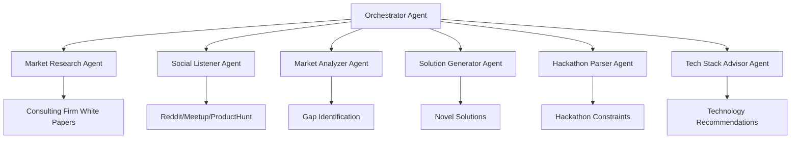

# MarketGap AI 🚀

A sophisticated market research and gap analysis system powered by **Letta stateful agents**. MarketGap AI automatically discovers untapped market opportunities by analyzing consulting firm white papers, social signals, and industry trends.

## Why Letta? 🧠

**Letta** is fundamentally different from other AI frameworks:

- **🔄 Stateful Agents**: Unlike stateless ChatCompletion APIs, Letta agents maintain memory and learn over time
- **🛠️ Server-side Tools**: Agents can execute tools (web search, code execution) on the server
- **💾 Persistent Memory**: All agent state is stored in a database and persists across sessions
- **🤝 Multi-Agent Communication**: Agents can communicate with each other to form complex workflows
- **📝 Self-Editing Memory**: Agents can update their own memory blocks to retain learnings

This makes Letta perfect for long-running research processes where agents need to accumulate knowledge over time.

## System Architecture 🏗️

MarketGap AI uses multiple specialized Letta agents that work together:



### Agent Roles

| Agent | Primary Function | Memory Blocks | Tools |
|-------|------------------|---------------|-------|
| **Orchestrator** | Workflow coordination, retry logic | `workflow_state`, `persona` | Memory management |
| **Market Research** | Crawl consulting firm white papers | `consulting_docs`, `firm_list`, `persona` | `web_search`, `run_code` |
| **Social Listener** | Monitor audience signals | `audience_signals`, `persona` | Social platform APIs |
| **Market Analyzer** | Identify market gaps | `gap_list`, `persona` | Analysis tools |
| **Solution Generator** | Generate novel solutions | `idea_history`, `final_ideas`, `persona` | Creativity tools |
| **Hackathon Parser** | Extract constraints | `constraints`, `persona` | Web scraping |
| **Tech Stack Advisor** | Recommend technologies | `tech_stack`, `persona` | Technology database |

## 🛠️ Setup & Installation

### Prerequisites

1. **Node.js 16+** and **npm**
2. **Letta Cloud Account** ([Sign up here](https://app.letta.com))
3. **Letta API Key** ([Get one here](https://app.letta.com/api-keys))

### Installation

```bash
# Clone the repository
git clone <your-repo-url>
cd market-gap

# Install dependencies
npm install

# Set up environment variables
cp .env.example .env.local
# Edit .env.local and add your LETTA_API_KEY
```

### Environment Configuration

Create a `.env.local` file with:

```bash
# Required: Letta Configuration
LETTA_API_KEY=your_letta_cloud_api_key_here
LETTA_BASE_URL=https://api.letta.com

# Optional: Agent IDs (auto-populated after first run)
ORCHESTRATOR_AGENT_ID=
MARKET_RESEARCH_AGENT_ID=

# Optional: External API Keys for enhanced functionality
TAVILY_API_KEY=your_tavily_key_for_web_search
E2B_API_KEY=your_e2b_key_for_code_execution
```

## 🚀 Quick Start

1. **Install dependencies**
   ```bash
   npm install
   ```

2. **Set up environment variables**
   ```bash
   # Copy the example environment file
   cp .env.example .env.local
   
   # Add your Letta API key
   LETTA_API_KEY=your_letta_api_key_here
   ```

3. **Start the development server**
   ```bash
   npm run dev
   ```

4. **Open the application**
   Navigate to [http://localhost:3000](http://localhost:3000)

## 🧪 Testing the Research Flow (Steps 1-2)

To test the first 2 steps of the workflow (Industry Selection → Comprehensive Market Research → Output):

### Option 1: Using the Web Interface

1. **Start the development server**
   ```bash
   npm run dev
   ```

2. **Navigate through the workflow**
   - Go to http://localhost:3000
   - Select an industry (e.g., "FinTech")
   - Click "Start Market Research"
   - The system will automatically research ALL major consulting firms
   - Watch the comprehensive research progress on the research page
   - View the consolidated research output in real-time

### Option 2: Using the Test Script

1. **Run the research flow test**
   ```bash
   npx ts-node src/scripts/testResearchFlow.ts
   ```

2. **What the test does:**
   - Initializes all Letta agents
   - Starts PDF crawling for ALL consulting firms (McKinsey, Deloitte, BCG, Bain, Accenture)
   - Monitors progress for 15 seconds
   - Displays research status, chunks, and summary from all firms
   - Shows memory state of the research agent

### Option 3: Using API Endpoints Directly

You can also test the API endpoints directly:

```bash
# Initialize agents
curl -X POST http://localhost:3000/api/agents/initialize

# Start comprehensive PDF crawling
curl -X POST http://localhost:3000/api/agents/research \
  -H "Content-Type: application/json" \
  -d '{"action": "crawl_pdfs", "firmNames": ["McKinsey & Company", "Deloitte", "Boston Consulting Group", "Bain & Company", "Accenture"], "industry": "fintech"}'

# Get research chunks
curl http://localhost:3000/api/agents/research?type=chunks

# Get research status
curl http://localhost:3000/api/agents/research?type=status

# Get research summary
curl http://localhost:3000/api/agents/research?type=summary
```

## 📊 Viewing Research Output

The research output can be viewed in several ways:

1. **Web Interface**: The research page shows real-time progress and displays the research output in a formatted card
2. **API Endpoints**: Use the `/api/agents/research` endpoint with different `type` parameters
3. **Console Logs**: Check the browser console and server logs for detailed agent interactions

### Research Output Format

The research agent will output:
- **PDF Chunks**: Raw text chunks extracted from consulting firm documents
- **Research Status**: Current progress and processing status
- **Research Summary**: Comprehensive summary of findings
- **Memory State**: Agent's memory blocks containing processed data

## 🔬 Consulting Firms Analyzed

The Market Research Agent automatically searches for white papers and reports from:

- **McKinsey & Company**
- **Boston Consulting Group**
- **Bain & Company**
- **Accenture**
- **Deloitte Consulting**
- **PwC Strategy&**
- **EY-Parthenon**
- **KPMG Advisory**
- **Booz Allen Hamilton**
- **Oliver Wyman**

## 📚 Usage Examples

### Initialize Agents Programmatically

```typescript
import { agentManager } from './src/utils/agentManager';

// Initialize all agents
const agentIds = await agentManager.initializeAllAgents();
console.log('Agent IDs:', agentIds);

// Start research for a specific industry
await agentManager.startMarketResearchWorkflow('FinTech');

// Get research results
const summary = await agentManager.marketResearch.getResearchSummary();
console.log('Research Summary:', summary);
```

### Use Individual Agents

```typescript
import { MarketResearchAgent } from './src/agents/marketResearch';

const agent = new MarketResearchAgent();
await agent.initialize();

// Research specific consulting firms
await agent.startResearch('Digital Transformation', [
  'McKinsey & Company',
  'Boston Consulting Group'
]);

// Get memory state
const memory = await agent.getMemoryState();
console.log('Agent Memory:', memory);
```

### Inter-Agent Communication

```typescript
// Send message between agents
await agentManager.sendInterAgentMessage(
  'orchestrator',
  'marketResearch',
  'Please provide your latest findings for analysis'
);
```

## 🌐 API Endpoints

| Endpoint | Method | Description |
|----------|--------|-------------|
| `/api/agents/initialize` | GET | Check agent initialization status |
| `/api/agents/initialize` | POST | Initialize all agents |
| `/api/agents/research` | POST | Start research workflow |
| `/api/agents/research?type=summary` | GET | Get research summary |
| `/api/agents/research?type=status` | GET | Get workflow status |
| `/api/agents/research?type=memory` | GET | Get agent memory state |

## 🎯 Memory Management

Letta agents use **memory blocks** for context management:

### Market Research Agent Memory

```typescript
{
  persona: "I am the Market Research Agent...",
  consulting_docs: "Summaries of white papers...",
  firm_list: "McKinsey & Company, BCG, Bain..."
}
```

### Orchestrator Agent Memory

```typescript
{
  persona: "I am the Orchestrator Agent...",
  workflow_state: "Current phase: market_research, Status: active..."
}
```

## 🔧 Advanced Configuration

### Workflow Phases

The system follows these phases (as per cursor rules):

1. **initialization** - Setup and agent coordination
2. **market_research** - Crawl consulting firm documents
3. **social_listening** - Monitor audience signals
4. **market_analysis** - Identify gaps and opportunities
5. **solution_generation** - Generate novel solutions
6. **hackathon_parsing** - Extract constraints
7. **tech_stack_advisory** - Recommend technologies

### Retry Logic

- Maximum **3 retries** per phase (configurable)
- Automatic failure handling and recovery
- Workflow status tracking (`partial`, `completed`, `failed`)

### Memory Limits

- **10 MB cap per memory block** (auto-archival to Supabase)
- Automatic memory optimization
- Timestamped updates for all changes

## 🐛 Troubleshooting

### Common Issues

1. **"Invalid API Key"**
   ```bash
   # Check your Letta API key
   echo $LETTA_API_KEY
   # Get a new one: https://app.letta.com/api-keys
   ```

2. **"Quota Exceeded"**
   ```bash
   # Check your Letta Cloud billing
   # Visit: https://app.letta.com/settings
   ```

3. **"Agent Not Initialized"**
   ```bash
   # Run the initialization
   npm run agents:init
   ```

### Debug Mode

```typescript
// Enable verbose logging
process.env.DEBUG = 'letta:*';

// Check agent status
const status = await agentManager.getWorkflowStatus();
console.log('Debug Status:', status);
```

## 📖 Development

### Project Structure

```
src/
├── agents/
│   ├── orchestrator/         # Workflow coordinator
│   ├── marketResearch/       # White paper crawler
│   └── ...                   # Other specialized agents
├── config/
│   └── letta.ts             # Letta configuration
├── utils/
│   └── agentManager.ts      # Agent coordination
└── scripts/
    └── demo.ts              # Demo and testing
```

### Adding New Agents

1. Create agent class in `src/agents/<agent-name>/`
2. Add memory blocks to `src/config/letta.ts`
3. Register with `AgentManager`
4. Update workflow phases

### Testing

```bash
# Test agent initialization
npm run agents:test

# Run full demo
npm run demo

# Test API endpoints
npm run dev
```

## 🤝 Contributing

1. Fork the repository
2. Create a feature branch (`git checkout -b feature/amazing-feature`)
3. Commit your changes (`git commit -m 'Add amazing feature'`)
4. Push to the branch (`git push origin feature/amazing-feature`)
5. Open a Pull Request

## 📄 License

This project is licensed under the MIT License - see the [LICENSE](LICENSE) file for details.

## 🙏 Acknowledgments

- **[Letta](https://letta.com)** - For the stateful agent infrastructure
- **[Ant Design](https://ant.design)** - For the beautiful UI components
- **[Next.js](https://nextjs.org)** - For the full-stack framework

---

**Ready to discover the next big market opportunity?** 🎯

Run `npm run demo` to get started!