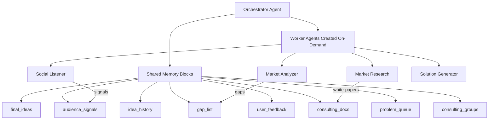

# MarketGap AI 🚀

A simplified market research and gap analysis system powered by **Letta's native multi-agent capabilities**. MarketGap AI discovers untapped market opportunities by analyzing consulting firm white papers, social signals, and industry trends using a clean, Letta-native architecture.

## 🎯 Why Letta-Native?

This implementation follows **Letta best practices exactly**:

- **🤝 Manager-Worker Pattern**: Single Orchestrator Agent manages all worker agents
- **📝 Shared Memory Blocks**: All agents share state via Letta's native memory system  
- **🛠️ Built-in Tools**: Uses Letta's native multi-agent communication tools
- **🔄 Exact Workflow**: Follows the precise 8-step sequence from workspace rules
- **💾 Persistent State**: All agent state persists automatically in Letta's database

## 🏗️ Simplified Architecture



### **Shared Memory Blocks (Per Workspace Rules)**
- `consulting_groups` (100 KB) - CSV/JSON of consulting firms
- `consulting_docs` (10 MB) - PDF chunks {tag, text}
- `gap_list` (256 KB) - Market gaps {id, title, severity, summary}
- `audience_signals` (5 MB) - Social signals {platform, author, text, sentiment}
- `problem_queue` (64 KB) - Ordered gaps sent to UI
- `user_feedback` (64 KB) - User feedback {problemId, action, notes}
- `idea_history` (2 MB) - All brainstorming iterations
- `final_ideas` (128 KB) - Approved novel ideas

### **Exact Workflow Sequence**
1. **marketResearch (async)** – crawl PDFs from consulting firms
2. **marketAnalyzer (wait)** – produce `gap_list`
3. **socialListener (wait)** – write combined audience & Google insights to `audience_signals`
4. Push `problem_queue` to UI → wait for user choice
5. **solutionGenerator (wait)** – iterative brainstorming loop
6. **competitorResearch (wait)** – evaluate novelty
7. If hackathon URL → **hackathonParser** then **techStackAdvisor**
8. Emit `workflow_complete`

## 🛠️ Setup & Installation

### Prerequisites
- **Node.js 16+** and **npm**
- **Letta Cloud Account** ([Sign up here](https://app.letta.com))
- **Letta API Key** ([Get one here](https://app.letta.com/api-keys))

### Installation
```bash
# Clone the repository
git clone <your-repo-url>
cd market-gap

# Install dependencies
npm install

# Set up environment variables
cp .env.example .env.local
# Edit .env.local and add your LETTA_API_KEY
```

### Environment Configuration
Create a `.env.local` file:
```bash
# Required: Letta Configuration
LETTA_API_KEY=your_letta_cloud_api_key_here
LETTA_BASE_URL=https://api.letta.com
```

## 🚀 Quick Start

### Option 1: Web Interface
```bash
npm run dev
# Navigate to http://localhost:3000/simple
```

### Option 2: Test Script  
```bash
npm run test:simple
```

### Option 3: API Direct
```bash
# Initialize orchestrator
curl -X POST http://localhost:3000/api/simple-workflow \
  -H "Content-Type: application/json" \
  -d '{"action": "initialize"}'

# Start workflow
curl -X POST http://localhost:3000/api/simple-workflow \
  -H "Content-Type: application/json" \
  -d '{"action": "start_workflow", "industry": "FinTech"}'

# Get status
curl http://localhost:3000/api/simple-workflow?action=status
```

## 📁 Project Structure

```
market-gap/
├── src/
│   ├── agents/
│   │   └── simple-orchestrator.ts    # Main Letta-native orchestrator
│   ├── scripts/
│   │   └── test-simple.ts           # Automated testing
│   ├── components/                  # React UI components
│   ├── context/                     # React context
│   └── types/                       # TypeScript types
├── app/
│   ├── api/
│   │   └── simple-workflow/         # Single API endpoint
│   ├── simple/                      # Test page
│   └── [other pages]/              # Additional UI pages
├── README.md                        # This file
└── SIMPLIFIED_APPROACH.md          # Detailed documentation
```

## 🧪 Testing

All testing is now simplified to a single command:
```bash
npm run test:simple
```

This will:
1. ✅ Initialize the Orchestrator Agent with shared memory blocks
2. ✅ Start a workflow for the FinTech industry  
3. ✅ Verify shared memory blocks are working
4. ✅ Test memory block updates
5. ✅ Display comprehensive status information

## 🔧 How It Works

### **Single Orchestrator Agent**
- Creates and manages all worker agents using Letta's built-in tools
- Uses `send_message_to_agent_async` for non-blocking tasks
- Uses `send_message_to_agent_and_wait_for_reply` for blocking steps
- Maintains workflow state in shared memory blocks

### **Shared Memory System**
- All agents access the same memory blocks
- Memory persists automatically across sessions
- Follows exact memory block structure from workspace rules
- 10 MB block cap with automatic archival

### **Built-in Letta Tools**
- `web_search` - For research tasks
- `run_code` - For data processing
- Native multi-agent communication tools
- No custom tools needed

## 📊 Benefits of Simplified Approach

| Before (Complex) | After (Simplified) |
|------------------|-------------------|
| 7 agent classes + custom tools | 1 orchestrator using Letta's built-ins |
| Multiple API routes | 1 API endpoint |
| Complex agent manager | Native Letta multi-agent system |
| Custom memory system | Shared memory blocks |
| 500+ lines of config | Environment variables only |

## 📚 Documentation

- **[SIMPLIFIED_APPROACH.md](./SIMPLIFIED_APPROACH.md)** - Detailed technical documentation
- **[Letta Multi-Agent Systems](https://docs.letta.com/guides/agents/multi-agent)** - Official Letta docs
- **[Multi-Agent Shared Memory](https://docs.letta.com/guides/agents/multi-agent-shared-memory)** - Shared memory guide

## ✅ Key Features

- ✅ **Letta-Native**: Uses built-in multi-agent capabilities
- ✅ **Shared Memory**: Proper shared memory blocks following workspace rules
- ✅ **Manager-Worker**: Single orchestrator manages worker agents  
- ✅ **Exact Workflow**: Follows 8-step sequence precisely
- ✅ **Simple Testing**: Single command testing
- ✅ **Clean Architecture**: No unnecessary complexity
- ✅ **Proper Documentation**: Clear, comprehensive guides

## 🎯 Next Steps

1. Run `npm run test:simple` to verify everything works
2. Open http://localhost:3000/simple to test the web interface
3. Check shared memory blocks are updating correctly
4. Extend with additional worker agents as needed
5. Deploy to production using Letta Cloud

## ⚠️ Status: Backend Stable · Front-End WIP

The multi-agent **backend** (Orchestrator → Market-Research → Market-Analyzer → Social-Listener) is fully functional and passes all automated tests.  
However, the **Next.js front-end is still under heavy development** – navigation works, but many pages show placeholder data and WebSocket updates are stubbed. Use the provided scripts (`npm run test:simple`) or the API endpoints to exercise the workflow until the UI is finished.

---

**Built with Letta's stateful agent framework - the future of AI applications.**